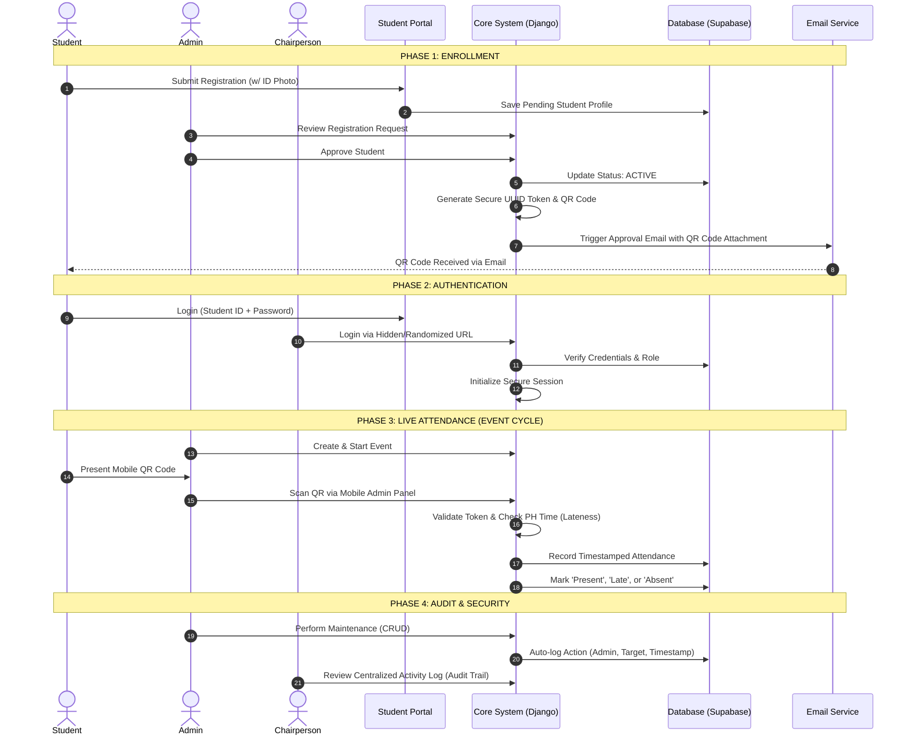

# CODE-IT: Enterprise System Architecture

This document provides a comprehensive overview of the **CODE-IT Attendance Portal** system architecture, operational workflows, and security models. It is designed for developers, administrators, and stakeholders to understand the ecosystem at an enterprise level.

---

## 1. System High-Level Flowchart

This diagram illustrates the lifecycle of a student from registration to attendance, along with administrative oversight and the core security layers.

---

## 2. Core Functional Modules

### A. Student Portal (`student_portal`)
- **Profile Management**: Self-registration, profile picture updates, and password security.
- **Attendance Insight**: Personal dashboard showing total "Present," "Late," and "Absent" statistics.
- **Digital ID**: Secure view of the student's unique attendance QR code.

### B. Admin Panel (`admin_panel`)
- **Student Vetting**: Multi-lane management of Pending, Active, and Rejected student records.
- **Section Automation**: Bulk creation and automated alphanumeric sorting of academic sections.
- **Event Lifecycle**:
    - **START**: Opens the scanner for check-in.
    - **GRACE**: Permits attendance with "Late" status.
    - **END**: Closes check-in and opens check-out.
    - **CLOSE**: Finalizes records and generates XLSX reports.
- **Scanning Engine**: Mobile-responsive scanner with real-time validation against the student's encrypted token.

### C. Chairperson Command Center
- **RBAC Management**: Assignment of VITS Officers and Representatives to specific sections.
- **Infrastructure Control**: Dedicated tools for system-wide section and officer configuration.
- **Audit Oversight**: Access to the centralized **Activity Log** to monitor every administrative action for accountability.

---

## 3. Technology Stack

| Layer | Technology |
| :--- | :--- |
| **Backend** | Django 5.x / Python 3.12 |
| **Database** | Supabase (PostgreSQL) |
| **Authentication** | Custom Session-based RBAC |
| **Integrations** | SMTP (Email Notifications), QR Code Py Lib |
| **Frontend** | Bootstrap 5, Vanilla JS, Mermaid.js |

---

## 4. Security & Compliance
- **Activity Logging**: No critical action (student approval, event deletion, user creation) occurs without a server-side audit record.
- **Data Privacy**: Per recent security audits, IP addresses are excluded from logs to maintain administrator privacy.
- **Role Isolation**: Strict `@role_required` decorators prevent horizontal and vertical privilege escalation.
